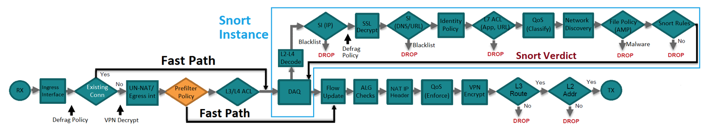
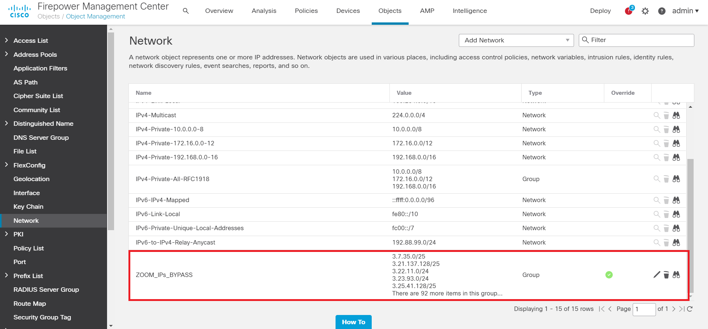
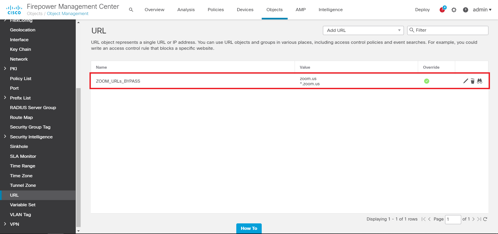
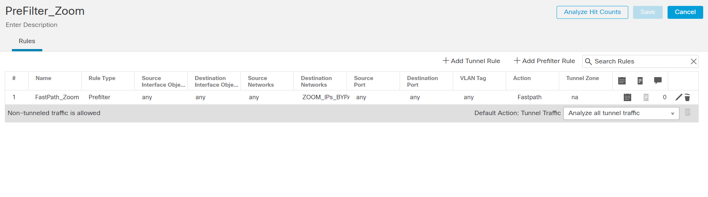
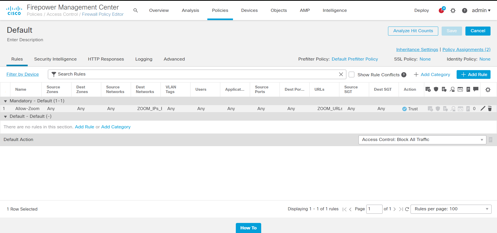

# Zoom Web Service API para o Firepower Objects Parser

# Autor(s)
<b> Este script é origimente feito por: 
	• Christopher van der Made (Cisco) 
	• Alan Nix (Cisco) 
	• *Valentim Uliana (Cisco) 
	Modificado por mim, muitas mudanças, melhorias e claro o suporte à plataforma do Zoom.
</b>

Este é um script de amostra que analisa IP's e URL's publicados no site da <a href = "https://support.zoom.us/hc/en-us/articles/201362683-Network-firewall-or-proxy-server-settings-for-Zoom">Zoom</a>. O script analisará todos os IP's e URL's de serviço de Web do Zoom em 2 lista (respectivamente) e usará a API do FMC para carregar em grupos de objetos. Esses objetos de grupo podem ser usados em uma regra de "trust" / "prefilter" do FirePower. Ao fazer isso, o tráfego é excluído de inspeção adicional para evitar problemas de latência com os aplicativos Zoom.

# Features
• Pegar todos IPs e URLs do Zoom com REST-based web service; 
• Criação de arquivos no formato JSON e colocados na pasta json do diretório, para API do FMC (PUT requests) 
• Upa este JSON para o FMC, sobrescrevendo o Objeto de Grupo anterior; 
• Checa se o arquivo do Zoom foi atualizado e aplica a atualização automáticamente; 
• Auto-Deploy de política usando API quando mudanças foram feitas nos Objetos (OPCIONAL*** E cuidado, isso também implementará outras mudanças de política não relacionadas); 
• Alerta via Webex Teams quando alguma mudança no objeto for feita; 
• Verificação constante se há atualizações com um intervalo de tempo especificado (OPCIONAL). 
• Configurações podem ser mudadas através do arquivo config.json, caso não for baixado o script cria esse arquivo automáticamente.

# Cisco Products / Services
• Cisco Firepower Management Center; 
• Cisco Firepower Threat Defense NGFW.

# Instalação
Essas instruções permitirão que você baixe o script e execute-o, de modo que a saída possa ser usada no Firepower como Group Objects. O que você precisa para começar? Lista de tarefas abaixo:

1. Você precisa do endereço IP (ou nome de domínio) do FMC, o nome de usuário e a senha. Eles serão solicitados pelo script na primeira vez que for executado. É recomendável criar uma conta de login pro FMC separada para uso da API, caso contrário, o administrador será desconectado durante todas as chamadas de API. Adicione o IP/Domínio da FMC, o nome de usuário e a senha ao arquivo config.json. Se você não adicionar nada, será solicitado que preencha isso ao executar o script.

2. No FMC, vá até System > Configuration > REST API Preferences para ter certeza que a opção REST API está ativada no FMC.

3. Um 'Network Group Obejct' e um 'URL Group Obejct' serão criados automaticamente durante a primeira execução do script.

4. *** OPICIONAL *** Também é recomendável baixar um certificado SSL do FMC e colocá-lo na mesma pasta dos scripts. Isso será usado para se conectar com segurança ao FMC. No arquivo config.json, defina o parâmetro "SSL_VERIFY" como 'true' e, em seguida, defina "SSL_CERT" com o caminho para o certificado do FMC.

5. É possível integrar o script com Webex Teams. Para fazer isso, um token de acesso de API e um ID de sala precisam ser inseridos no arquivo config.json.Por favor, pegue sua chave em: <a href="https://developer.webex.com/docs/api/getting-started">https://developer.webex.com/docs/api/getting-started</a>. Em seguida, crie um espaço Webex Teams dedicado para essas notificações e pegue o ID da sala: <a href="https://developer.webex.com/docs/api/v1/rooms/list-rooms">https://developer.webex.com/docs/api/v1/rooms/list-rooms</a>. Esteja ciente de que o token pessoal da página de primeiros passos só funciona por 12 horas. Siga estas etapas para solicitar um token por solicitação: <a href="https://developer.webex.com/docs/integrations">https://developer.webex.com/docs/integrations</a>. * Requerimento para usar webexteams: <a href="https://github.com/CiscoDevNet/webexteamssdk">https://github.com/CiscoDevNet/webexteamssdk.</a> Caso tenha problemas com esse item para instalar o webexteamssdk basta comentar a linha 10 do script: 
DE: <b>import webexteamssdk</b> 
PARA: <b> #import webexteamssdk </b>

6. Se você não tiver as bibliotecas Python necessárias configuradas, receberá um erro ao executar o script. Você precisará instalar o arquivo "requirements.txt": (certifique-se de que está no mesmo diretório que os arquivos clonados do git): 
<b> pip install -r requirements.txt</b>
	
7. Depois de concluído, você precisa executar o script (certifique-se de estar no mesmo diretório que os arquivos clonados do git): 
<b> python3.6 Zoom_API.py </b>
	
8. Opcionalmente, você pode permitir que este script seja executado periodicamente, definindo "SERVICE" como true no arquivo config.json. Através da do arquivo config.json, coloque o período de tempo desejado em <b>segundos</b>, por padrão é definido como uma hora (recomendo que você verifique a versão diariamente, ou no máximo a cada hora): 
<b> "intervalScheduler_Time": 3600 # 3600 = 1 hora </b>
	
9. Finalmente, se desejar fazer o deploy as políticas automaticamente, você pode definir "AUTO_DEPLOY" como true no arquivo config.json. Tenha muito cuidado com isso, pois políticas não concluídas podem ser implantadas ao fazer isso.

# Como usar os objetos de grupo no Firepower Management Center

Para uma melhor compreensão do fluxo de pacotes no Firepower Threat Defense e como funciona a ação Fastpath na Política de pré-filtro, revise o seguinte diagrama de fluxo:  
   

Após as solicitações PUT bem-sucedidas, os 2 Objetos de Grupo serão atualizados com os novos endereços IP e URLs. Segue print dos 2 objetos de grupo, após a chamada de API  
   
   

Esses objetos podem ser usados em qualquer regra de Fastpath da política de pré-filtro (para o objeto de rede) ou em uma regra de confiança da política de controle(ACP) de acesso (para o objeto de URL). Este é um exemplo de como configurar a regra da Política de Pré-filtro no FMC:   
   

Da mesma forma, isso pode ser feito com uma regra de "trust" na política de controle de acesso (ACP) para o objeto de 

URL e Network trabalhando juntos ou separado, claro que isso depende de cada ambiente:
   

# Tome cuidado com as seguintes notas:
• Esteja ciente de que um deploy de política é necessário para atualizar os Grupos de Objetos nas Políticas usadas. Atualmente, há uma chamada API opcional integrada para fazer um auto-deploy de política, no entanto, comod dito acima, tome cuidado ao usá-la, pois isso pode causar um deploy de outras políticas ou objetos não relacionados (por exemplo, se outro administrador de rede estiver trabalhando em uma política na GUI). 

• O importante é usar a verificação SSL e testar o script antes de executá-lo em um ambiente de produção. No arquivo config.json, defina o parâmetro "SSL_VERIFY" como true e, em seguida, defina "SSL_CERT" como o caminho para o certificado do FMC.  

• Teste isso adequadamente antes de implementar em um ambiente de produção. Este é um script de amostra.  

• Caso o intervalScheduler seja usado: o script em execução deve ser hospedado em um ambiente seguro! Por exemplo: se um agente malicioso puder colocar endereços IP ou URLs adicionais na lista de alguma forma, eles serão colocados em uma regra de confiança do Firepower e podem fazer com que o agente malicioso ignore a segurança.

